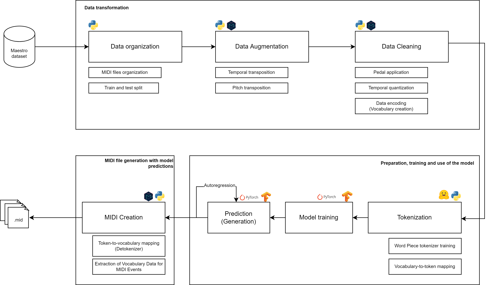

# Pipeline diagram

Below is a diagram of the pipeline starting from a MIDI dataset to generated MIDI file. This represents the whole training process, from the data preparation to the model training and the generation of the MIDI file.

> The diagram file located at `docs/pipeline-diagram/pipeline-diagram.drawio` is also available for any eventual modifications.

