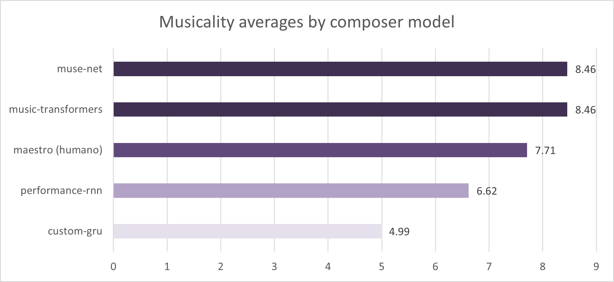

# Generating Music with Artificial Intelligence: Summary of Results

The main goal of this document is to bring an overview of the search results in a simplified way. Bearing this in mind, it is worth mentioning that this document is limited only to the results of the blind test, where 117 people around the world (Brazil, Canada, USA, Germany and France) evaluated 5 different musical excerpts. This group contains people with different musical backgrounds, ranging from people who don't listen to classical music to concert musicians.

Any other detail of this research can be clarified in this repo and in the paper [Generating music with data: Application of Deep Learning for symbolic musical composition](../Generating%20music%20with%20data%20-%20Pedro%20Ferreira.pdf). Before we go to the results, let's clarify some terms and concepts in a super simplified way in order to facilitate the interpretation of the data.

## What is a "model"?

For didactic purposes, we can interpret that a **model** = an **artificial intelligence**. We can
think that each model is an artificial "mini-brain" that is capable of creating music of a certain
form.

> **Curiosity about "models"**:
> - The term model comes from the conception of a statistical model
> - The structure of the models used in this research replicate in a certain proportion the functioning of our brain,
through **Artificial Neural Networks** (more specifically **Deep Learning**)

## How do Artificial Intelligences learn? 

There are several different types of models (or artificial intelligences) and each one learns in a different way, so this explanation will be limited to the models used in this research. In a simplified way, we can understand that these models learn through error.

First we give a bunch of examples of what is "right" for the model, and then we ask the model to try to achieve the result defined as "right" (through a lot of math and computing).

So for example, if the model was learning the alphabet, given the sequence “A, B, C, D”, the expected result to continue the sequence would be “E” (A, B, C, D, ***E***).

An "untrained" model will make an arbitrary choice for the sequence. Continuing with the alphabet example, 
imagine that the model said that after the letter **D** comes the **X**. As we already know that after the letter **D** 
comes **E**, the model learns through its error that **X** is not the right answer, and will try other letter
until eventually reaching **E**.

When the model doesn't get it right, we train the model until it gets it right (or comes very close to the
right answer) through “reward” mechanisms that strengthen the “neuronal connection” of the
correct attempt, leading consequently to the eventual understanding by the model that after the
letter **D** comes from **E**.

For musical generation, instead of the alphabet, the model is trained to identify the next note of a given sequence, being “rewarded” by hitting the correct note. The data used to train the model comes from a database called [Maestro](https://magenta.tensorflow.org/datasets/maestro), which contains more than 200 hours of piano performance. This base is then consumed by the model, song by song, snippet
per stretch, thousands of times, so that the model can learn the probability of next note according to prior given notes.

Evidently, in practice the hole is much lower, with many variables, data transformations and other things that are not worth going into detail here (but are detailed in the [paper](../Generating%20music%20with%20data%20-%20Pedro%20Ferreira.pdf)), involving a lot of data science, computer science and mathematics in the
means of all this to make the computer learn. For this brief explanation, let's stop here.

> **Curiosities about artificial neural networks:**
> - There is a mathematical theorem called the **Universal Approximation Theorem**, which describes that artificial neural networks functions can approximate any continuous function. In other words, if we manage to translate a problem
on data, we can create a neural network to understand how to solve that problem. However, complex problems
 demand complex networks, and some tasks that we see as trivial, such as listening, seeing, speaking or
move are extremely complex from a computational point of view (evidencing how amazing and powerful
is the human brain), requiring a huge computational demand. Yet, this demand gap on 
computing power has been decreasing every day due to the exponential technological growth of our society.
>
>- From the way the future presents itself, in a short time we will go through a new industrial revolution, from which
we will have artificial intelligences facilitating the operationalization of many tasks that today are carried out by human beings.
>
> - Artificial intelligences based on neural networks are already directly part of our lives (e.g. research
from google, translators, voice commands and smartphone facial recognition). AIs also play an indirect role in our daily lives, for example
recommendation systems, which recommend what to watch, given what you've watched before, according to your
profile, widely used by streaming companies and social networks such as meta (facebook), tiktok, netflix, youtube, etc.

The blind test of this research is based on 4 different models for music generation, each composer of one musical excerpt. You can hear them again by clicking on the links below:

- [Sample 1 - Music Transformers](https://soundcloud.com/pe_drojunior/sample-4?in=pe_drojunior/sets/samples&si=5f9659662147423bb29a0ea21580127a&utm_source=clipboard&utm_medium=text&utm_campaign=social_sharing)
- [Sample 2 - Performance RNN](https://soundcloud.com/pe_drojunior/sample-5?in=pe_drojunior/sets/samples&si=1f7a5bb9e0d444f8b73f539676b6e1c0&utm_source=clipboard&utm_medium=text&utm_campaign=social_sharing)
- [Sample 3 - MuseNet](https://soundcloud.com/pe_drojunior/sample-3?in=pe_drojunior/sets/samples&si=2f284500b2d943e5b6c3b65691418bdf&utm_source=clipboard&utm_medium=text&utm_campaign=social_sharing)
- [Sample 4 - Custom GRU](https://soundcloud.com/pe_drojunior/sample-1?in=pe_drojunior/sets/samples&si=cf23b81a29fb4e0781155c62a0b08a04&utm_source=clipboard&utm_medium=text&utm_campaign=social_sharing)
- [Sample 5 - Human playing piano](https://soundcloud.com/pe_drojunior/sample-2?in=pe_drojunior/sets/samples&si=b08b45045ff44b23a74699502702d075&utm_source=clipboard&utm_medium=text&utm_campaign=social_sharing)

Let's see the final results of the research, starting with the evaluation of the models between 0 to 10:

We can see here that the musical excerpts 1 and 3 (from models Music Transformers and MuseNet) were the highest rated, with an approval rating of approximately 8.4/10. Both beat the average rating of the human music excerpt (sample 5), which scored a 7.7/10. The Performance RNN model (sample 2) gets a reasonable approval while the Custom GRU model (sample 4) gets a clear rejection.

Speaking of approval, we can evaluate below the approval of each musical excerpt by model composer:

As in the previous chart (musicality averages), musical excerpts **1** and **3** (**Music Transformers** and **MuseNet**) were clearly recognized as excerpts from classical music, surpassing by a small margin the approval of the human piece of music. The pattern is also repeated with the other models, where musical excerpt **2** (**Performance RNN**) obtains a reasonable approval and musical excerpt **4** (**Custom GRU**) gets a clear rejection.

But now changing the focus a little bit from the approval of the excerpts to the hit rate of the population. How correctly did people guess that the piece of music was made by an AI and how much did they guess that it was composed by a human?

Surprisingly, the model of musical excerpt **3** (**MuseNet**) was able to deceive 64.42% of the
participants, being erroneously evaluated as "human composition" for a small advantage
than the originally human excerpt (**Maestro**). The music excerpt 1 (**Music Transformers**)
also achieved interesting results, managing to deceive more than half of the participants. The
other models were mostly correctly identified as musical excerpts made by a computer.

And to end the analysis, we can see in the graph below that people with high musical sensibilities, people with more technical musical experience, and people who listen to classical music were more assertive in identifying the origin of the musical excerpt:

**Population hit rate averages across the musical sensitivity spectrum:**

**Population hit rate average across spectrum of music experience:**

**Population hit rate averages across the classic music consumption frequency spectrum:**

## Final considerations

I hope that all this reading has clarified a little more about my research and about its results. I find it very interesting to see how some models of artificial intelligence can already do things that until recently we considered exclusively human, such as music. And in my opinion we are at the very beginning of unlocking the full potential that AI can bring into our lives.

As a musician and artist, I don't believe these technologies are coming to replace us, but
to democratize access to the art generation. Music generation technologies like the one demonstrated
in this work and other artistic generation technologies such as image generation through text
([Dall-E 2](https://openai.com/dall-e-2/), [MidJourney](https://www.midjourney.com/), [Stable Diffusion](https://stability.ai/blog/stable-diffusion-public-release)), 3d generation through text ([Magic3D](https://deepimagination.cc/Magic3D/)) or even generation of videos through text ([Make-A-Video](https://makeavideo.studio/)), I believe that we are marching to a world where the art generation will be a thought away from the people.

Have an idea of a music for your video's soundtrack? An AI will generate the music the way that you expect. Need an image to exemplify something or to generate content? It's just write to the AI that it will generate for you. The AI output wasn't exactly what you expected 
(which will likely be the reality within a professional context)? You can take the result and take it to a human to refine it.

Creative artificial intelligences did not come to replace humans, but to empower them, subtracting the middle field of technique (learning to draw, learning an instrument/composition, etc) and creating a direct connection between **idea -> content**.

But would these artificial intelligences be “artists” for achieving such a result? Where is the art in all of this? In the technique (which the AI can replicate) or in the original idea? How much can we call this art? Who is the artist? How does the relationship between _Artist -> Artwork -> Receiver_ look like with the addition of these technologies? We still don't have concrete answers to these questions, but I think it's worth thinking about it :)

For more information, click on the following links:
- [Intro to AI music](../intro-to-AI-music/README.md)
- [Generating music with data: Application of Deep Learning models for symbolic music composition](../Generating%20music%20with%20data%20-%20Pedro%20Ferreira.pdf)