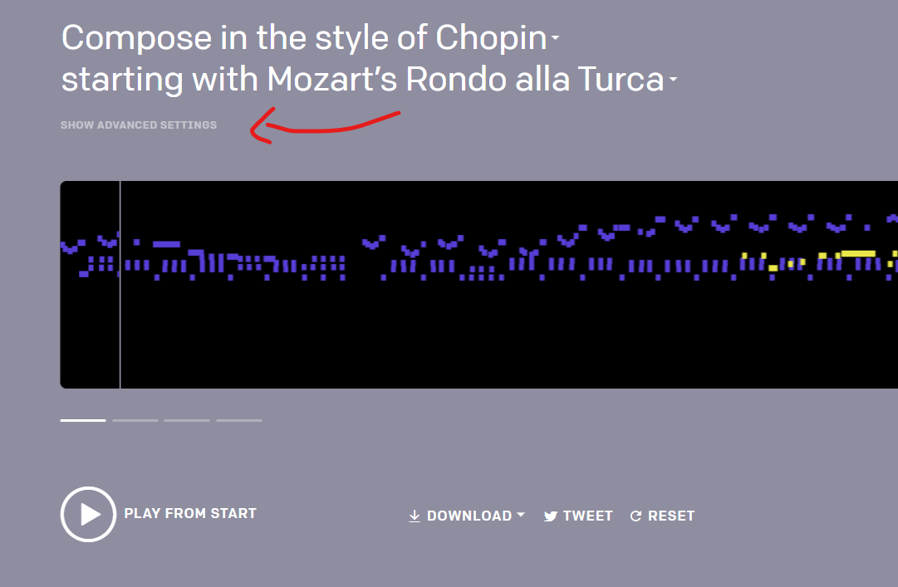
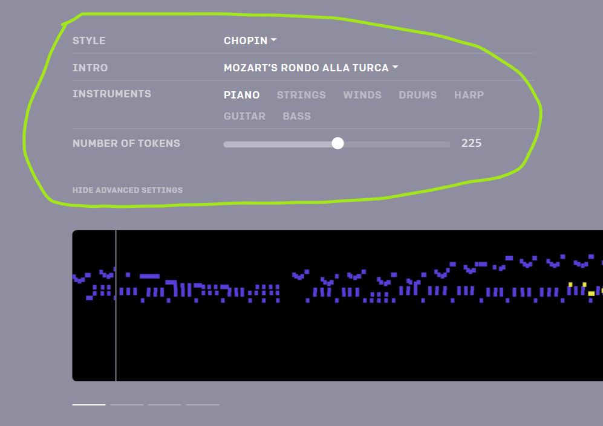

# MuseNet

The model MuseNet was not open sourced by OpenAI. Therefore, in order to generate music with MuseNet, one can play with the composer widget on the [MuseNet page website of OpenAI](https://openai.com/blog/musenet/).

In order to fine-tune the generation of the model, one can play with the advanced settings of the widget. 

